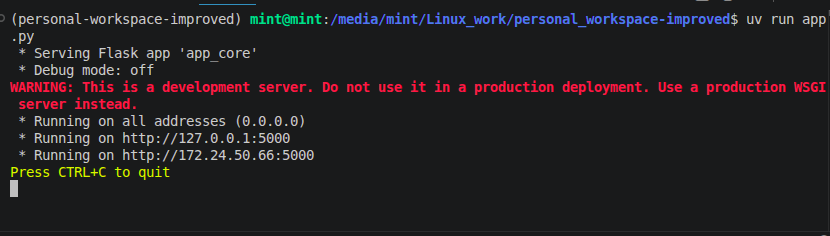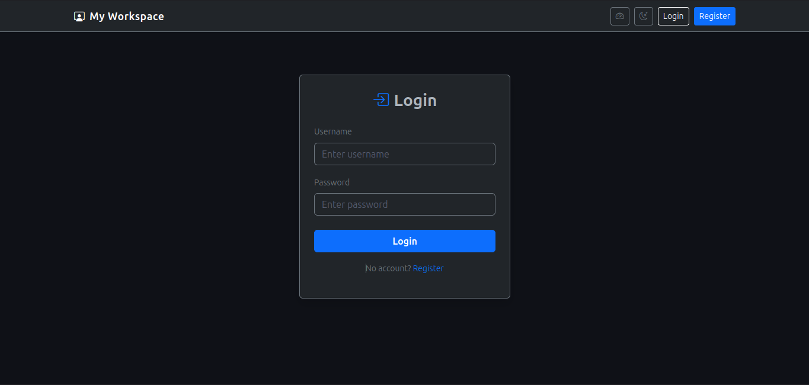 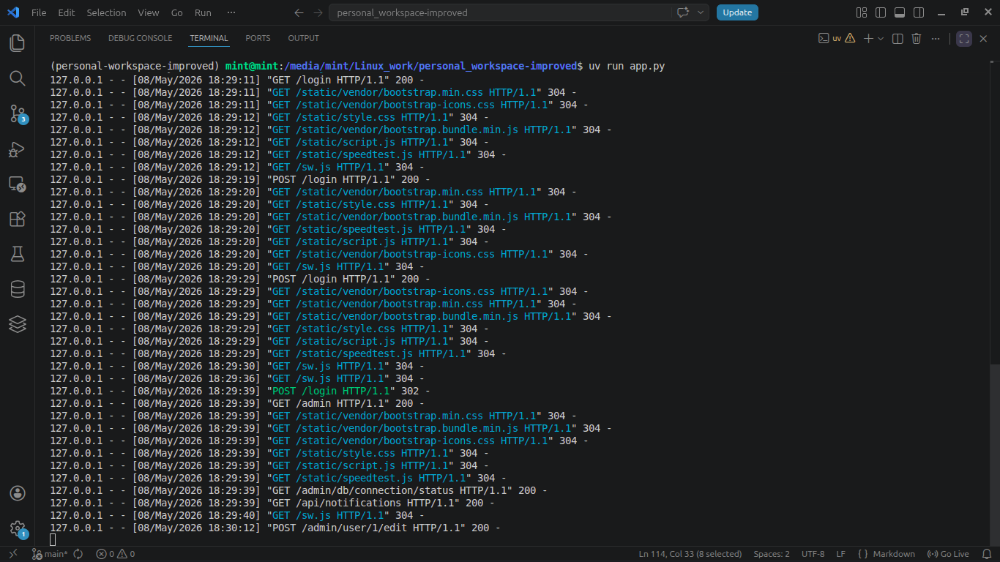 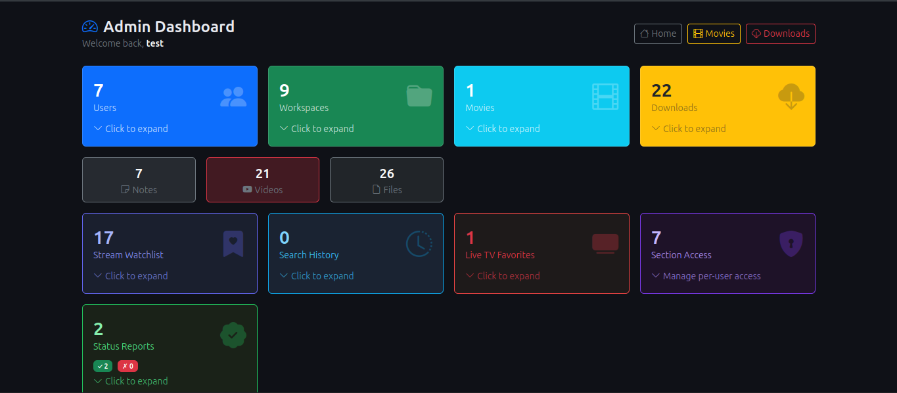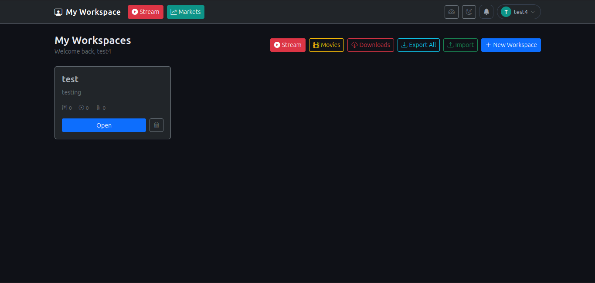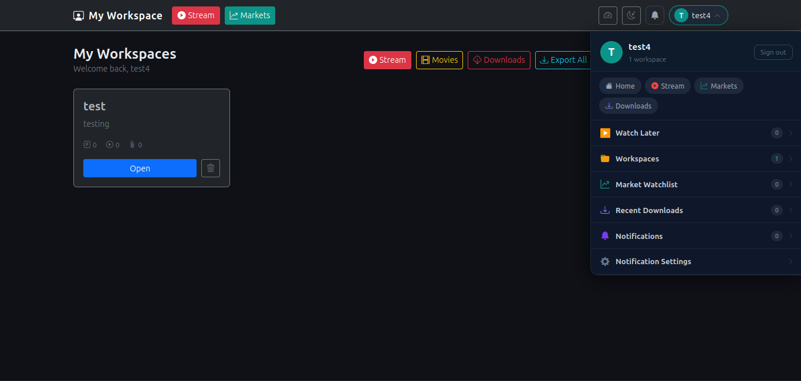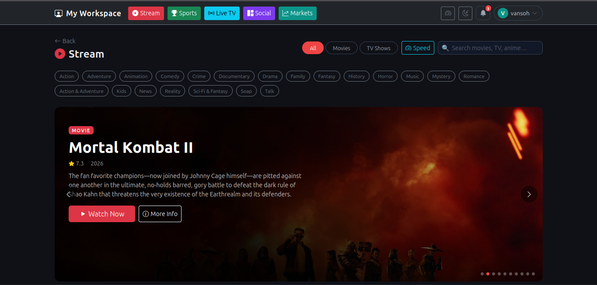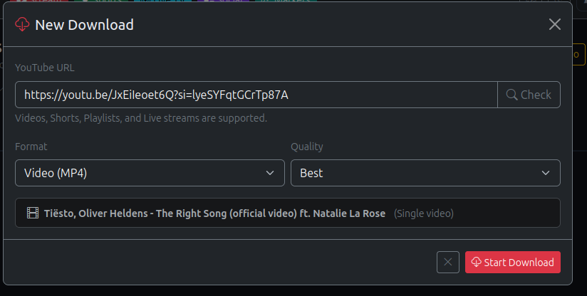](image-7.png)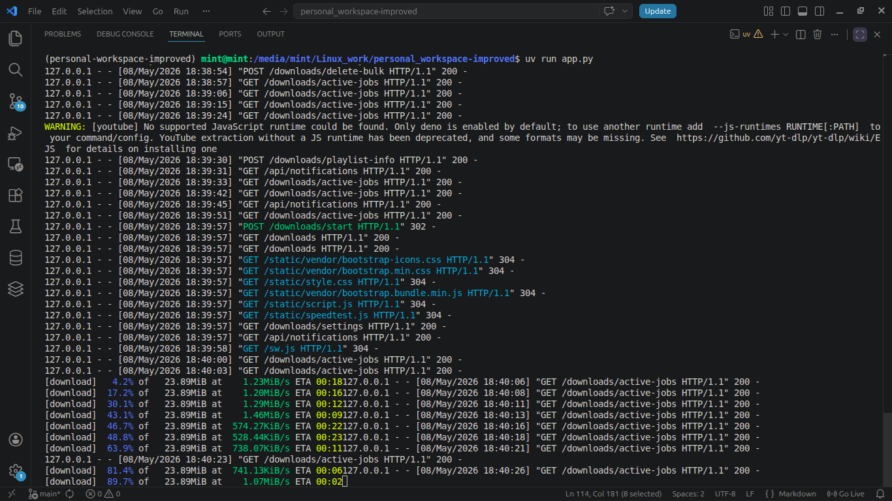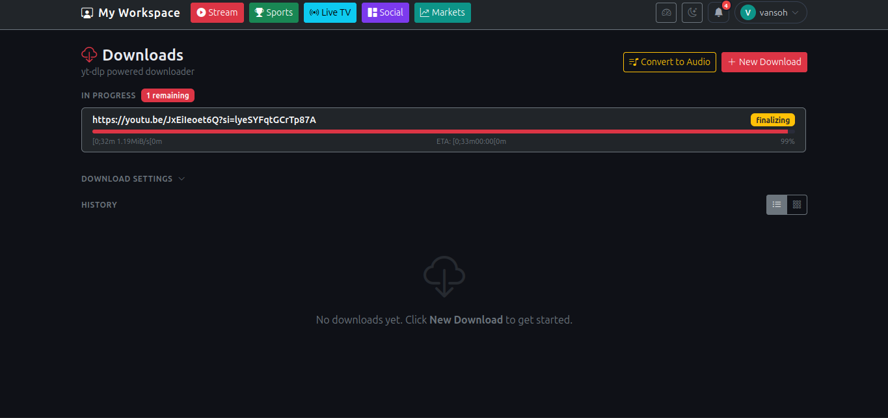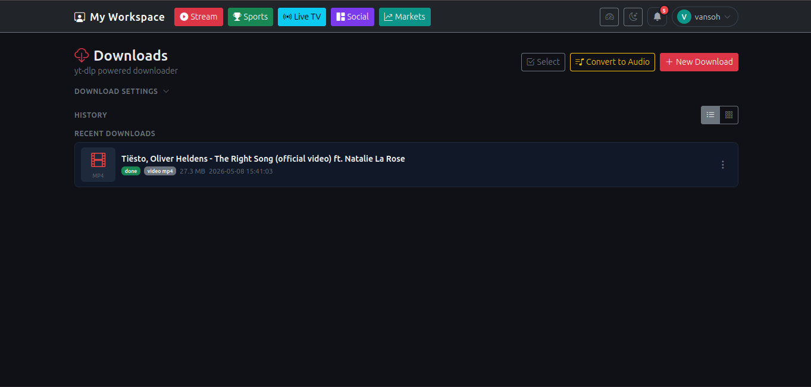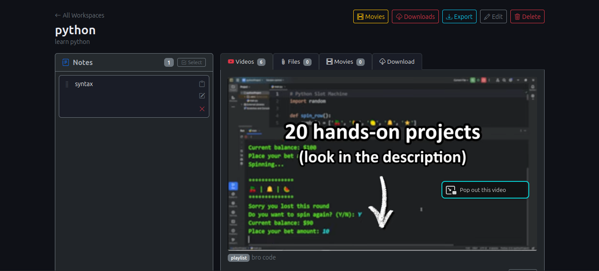

# Personal Workspace App

A Flask-based web application for workspace management, notes, file uploads, YouTube downloads, and streaming.

## Overview

Users can register, log in, create workspaces with notes/files/videos, download YouTube content, browse a personal movie library, and stream movies/TV from a full TMDB-powered browse page.

## Stack

- **Backend:** Python 3.12 / Flask
- **Database:** PostgreSQL with SQLite fallback (`workspace.db`) via `db_compat.py`
- **Frontend:** HTML/CSS/JavaScript with Bootstrap 5 and Jinja2 templating


## Database

The app uses a thin compatibility layer (`db_compat.py`) that translates SQLite dialect SQL (parameter `?`, `INSERT OR IGNORE`, `DATETIME`, `AUTOINCREMENT`) to PostgreSQL on the fly. When `DATABASE_URL` is set it connects to PostgreSQL; otherwise it falls back to `workspace.db` (SQLite). All existing data was migrated with `migrate_to_pg.py`.

## Key Features

- Multi-workspace note and file management
- YouTube download with yt-dlp (including playlist selection)
- VidNest movie/TV link library with inline player
- **Stream page** — TMDB-powered browse page (movies, TV, anime, search, genre filters) with VidNest embedded player
- **Markets page** — Financial tracker with:
  - Watchlist cards with sparklines, bullish/bearish/flat trend badges, and "Open Chart" button
  - Full-screen chart popup (`/markets/chart`) using TradingView Lightweight Charts with timeframe switching (1D–ALL), chart types (Candlestick, Heikin-Ashi, Bar, Line), symbol search/switch, add-to-watchlist/strategy from chart
  - OHLC API (`/markets/api/ohlc`) serving candlestick/bar/Heikin-Ashi data
  - Algo strategies (MA Crossover, RSI, Bollinger Bands, MACD, Combined)
  - Notification Center modal with per-strategy and per-watchlist alert channel routing (Telegram/WhatsApp)
  - Global Telegram/WhatsApp alert settings
- Admin dashboard (user management, global stats)
- Export/import workspaces as JSON or CSV
- Persistent floating media player (audio/video queue across all pages)
- Social Hub with YouTube watch+download, Spotify, Twitch, cross-platform search

## Project Structure

```
app.py              # Thin entry point — imports app_core, registers route modules
app_core.py         # Flask app factory + shared state (DB, auth helpers, globals)
routes/
  __init__.py
  helpers.py        # Shared encryption + notification send helpers
  core.py           # PWA (sw.js), home page, /api/status
  workspaces.py     # Workspace CRUD, notes, YouTube links, file uploads
  downloads.py      # yt-dlp download engine + all /downloads/* routes
  movies.py         # Standalone /movies page
  auth.py           # /login, /register, /logout, /admin panel
  livetv.py         # /stream, /livetv, /social, /sports + TMDb/ESPN proxies
  admin_db.py       # Admin DB backup / restore panel
  markets.py        # Markets tracker, charts, algo strategies, price alerts
  notifications.py  # Notification inbox + personal hub API
db_compat.py        # SQLite↔PostgreSQL compatibility shim
workspace.db        # SQLite database (fallback when DATABASE_URL not set)
static/
  script.js         # Frontend JS (AJAX, floating player, note editing, upload)
  style.css         # Custom styles
templates/
  base.html         # Base layout (navbar with Stream link, floating player)
  index.html        # Home page (workspace grid)
  stream.html       # Stream browse page (TMDB + VidNest)
  movies.html       # Personal movie library
  workspace.html    # Workspace detail (notes, files, videos, movies, downloads)
  dashboard.html    # Admin panel
  downloads.html    # Global downloads page
  login.html        # Login
  register.html     # Registration
uploads/            # User file uploads (per workspace)
user_downloads/     # yt-dlp downloads (per user/job)
backups/            # Admin DB backups
```

## API Endpoints

- `GET /api/status` — Health check
- `GET /api/tmdb/<path>` — TMDB API proxy (requires login, uses TMDB_READ_TOKEN)
- `GET /api/media-library` — List all user audio/video files for floating player
- `POST /workspace/<id>/note/<id>/edit` — Edit note (AJAX)
- `POST /workspace/<id>/movie/<id>/progress` — Save movie playback position

## Environment Variables

- `TMDB_API_KEY` — TMDB API key (v3)
- `TMDB_READ_TOKEN` — TMDB API v4 read access token (used by proxy)
- `SECRET_KEY` — Flask session secret (auto-generated into `.env` on first run)

## Running

- **Development:** `python3 app.py` (port 5000)
- **Production:** `gunicorn --bind=0.0.0.0:5000 --reuse-port app:app`

## DB Notes

- `notes` table uses `updated_at` (not `created_at`) and has an optional `title` column
- `movies` table uses `movie_url` / `movie_title` (not `url` / `title`)
- Passwords stored as **werkzeug pbkdf2 hashes** (auto-migrated from plaintext on first login)
- Admin users: `vansoh`, `test` (defined in `ADMIN_USERS` set)
- Schema migrations run automatically on startup (ALTER TABLE IF NOT EXISTS pattern)

## Security

- Passwords hashed with `werkzeug.security.generate_password_hash` (pbkdf2:sha256)
- Plaintext passwords in the DB are automatically migrated to hashed on next login
- Session secret loaded from `SECRET_KEY` env var (random 32-byte hex generated if missing)
- Workspace ownership enforced on all note/file/video/movie/progress routes (403 on mismatch)
- Download URLs validated: must be http/https and not private/loopback IPs
- ESPN sports proxy uses an allowlist of known sport paths
- Open redirect in download delete blocked via same-host referrer check
- Admin panel does not expose password hashes

